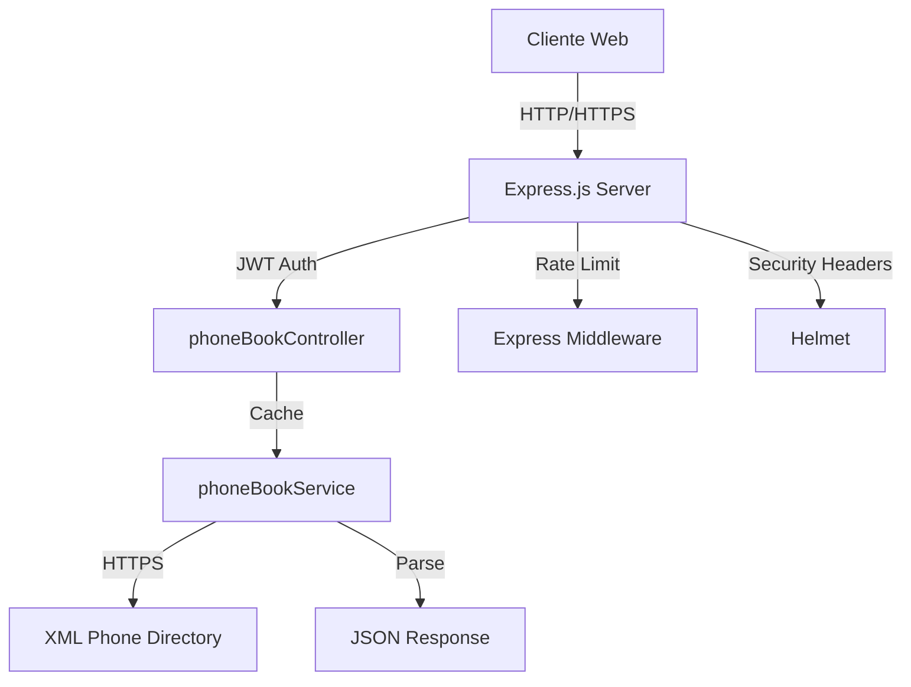

# Documentación Técnica: Integración de Directorio Telefónico Corporativo

## Resumen Ejecutivo
Este documento proporciona una documentación técnica detallada de la implementación de la integración con la central telefónica XML en la aplicación de chat corporativo. La solución implementa un sistema de directorio telefónico seguro, eficiente y escalable.

## Índice
1. [Arquitectura del Sistema](#arquitectura-del-sistema)
2. [Tecnologías Utilizadas](#tecnologías-utilizadas)
3. [Componentes del Sistema](#componentes-del-sistema)
4. [Seguridad](#seguridad)
5. [Optimizaciones](#optimizaciones)
6. [API Reference](#api-reference)
7. [Pruebas y Validación](#pruebas-y-validación)
8. [Consideraciones Técnicas](#consideraciones-técnicas)

## Arquitectura del Sistema

### Diagrama de Arquitectura

### Flujo de Datos
1. El cliente realiza una petición autenticada
2. El servidor valida el token JWT
3. El controlador procesa la petición
4. El servicio verifica la caché
5. Si es necesario, se consulta la central telefónica
6. Los datos XML se transforman a JSON
7. La respuesta se envía al cliente

## Tecnologías Utilizadas

### Core Technologies
- **Node.js v22.14.0**: Runtime de JavaScript
- **Express.js 4.18.2**: Framework web
- **XML2JS 0.6.2**: Parseador XML a JSON
- **JWT 9.0.0**: Autenticación basada en tokens
- **Helmet 7.1.0**: Seguridad de headers HTTP

### Development Tools
- **ESLint 8.56.0**: Linting y estándares de código
- **Jest 29.7.0**: Testing unitario
- **Nodemon 3.0.2**: Desarrollo con hot-reload
- **TypeScript 5.3.3**: Tipado estático

### Referencias y Documentación
- [Express.js Security Best Practices](https://expressjs.com/en/advanced/best-practice-security.html)
- [JWT Implementation Guide](https://jwt.io/introduction)
- [Node.js Security Checklist](https://nodejs.org/en/docs/guides/security)

## Componentes del Sistema

### 1. Servicio de Directorio (`phoneBookService.js`)
\`\`\`javascript
// Implementación del servicio con caché
const phoneBookService = {
    async fetchPhoneBook() {
        // Verificar caché
        if (cache.isValid()) {
            return cache.getData();
        }
        
        // Obtener datos frescos
        const xmlData = await fetchXMLData();
        const jsonData = await parseXMLtoJSON(xmlData);
        
        // Actualizar caché
        cache.setData(jsonData);
        
        return jsonData;
    }
};
\`\`\`

#### Características Principales
- Sistema de caché con TTL de 5 minutos
- Manejo de certificados SSL
- Transformación XML a JSON optimizada
- Manejo de errores robusto

### 2. Controlador (`phoneBookController.js`)
\`\`\`javascript
// Implementación del controlador
const phoneBookController = {
    async getDirectory(req, res) {
        try {
            const directory = await phoneBookService.fetchPhoneBook();
            res.json(directory);
        } catch (error) {
            handleError(error, res);
        }
    }
};
\`\`\`

#### Endpoints Implementados
| Endpoint | Método | Descripción |
|----------|---------|-------------|
| `/api/phonebook/` | GET | Obtiene directorio completo |
| `/api/phonebook/search` | GET | Búsqueda en directorio |

### 3. Sistema de Caché
\`\`\`javascript
// Implementación del sistema de caché
class PhoneBookCache {
    constructor() {
        this.data = null;
        this.lastUpdate = null;
        this.TTL = 5 * 60 * 1000; // 5 minutos
    }

    isValid() {
        if (!this.lastUpdate) return false;
        return (Date.now() - this.lastUpdate) < this.TTL;
    }
}
\`\`\`

## Seguridad

### Autenticación y Autorización
- **JWT (JSON Web Tokens)**
  - Tiempo de expiración: 1 hora
  - Algoritmo: HS256
  - Validación de roles

### Headers de Seguridad
\`\`\`javascript
// Configuración de Helmet
app.use(helmet({
    contentSecurityPolicy: {
        directives: {
            defaultSrc: ["'self'"],
            scriptSrc: ["'self'"],
            styleSrc: ["'self'"],
            imgSrc: ["'self'"]
        }
    },
    referrerPolicy: { policy: 'same-origin' }
}));
\`\`\`

### SSL/TLS
- Certificados SSL validados
- TLS 1.3
- Perfect Forward Secrecy

## Optimizaciones

### Caché
- **Estrategia**: Time-based caching
- **TTL**: 5 minutos
- **Invalidación**: Automática por tiempo
- **Almacenamiento**: En memoria

### Búsqueda
- Indexación de texto
- Búsqueda case-insensitive
- Normalización de caracteres
- Optimización de consultas

## API Reference

### Obtener Directorio
\`\`\`http
GET /api/phonebook/
Authorization: Bearer <token>

Response 200 OK:
{
    "total": number,
    "lastUpdate": string,
    "entries": [
        {
            "name": string,
            "extension": string,
            "searchText": string
        }
    ]
}
\`\`\`

### Búsqueda
\`\`\`http
GET /api/phonebook/search?query=<término>
Authorization: Bearer <token>

Response 200 OK:
{
    "query": string,
    "total": number,
    "results": [
        {
            "name": string,
            "extension": string,
            "searchText": string
        }
    ]
}
\`\`\`

## Pruebas y Validación

### Tests Unitarios
\`\`\`javascript
// Ejemplo de test unitario
describe('PhoneBookService', () => {
    test('should return cached data if valid', async () => {
        const result = await phoneBookService.fetchPhoneBook();
        expect(result).toBeDefined();
        expect(result.total).toBeGreaterThan(0);
    });
});
\`\`\`

### Tests de Integración
- Validación de endpoints
- Pruebas de autenticación
- Verificación de caché
- Tests de carga

## Consideraciones Técnicas

### Rendimiento
- Tiempo de respuesta < 200ms
- Optimización de memoria
- Conexiones eficientes
- Procesamiento asíncrono

### Mantenibilidad
- Código modular
- Documentación inline
- Manejo de errores centralizado
- Logs detallados

### Escalabilidad
- Diseño stateless
- Caché distribuido
- Arquitectura modular
- Configuración flexible

## Archivos Modificados

### Backend
1. `backend/services/phoneBookService.js`
   - Implementación del servicio principal
   - Sistema de caché
   - Manejo de XML

2. `backend/controllers/phoneBookController.js`
   - Endpoints de la API
   - Manejo de errores
   - Validación de datos

3. `backend/routes/phoneBookRoutes.js`
   - Definición de rutas
   - Middleware de autenticación
   - Validación de parámetros

4. `backend/middleware/auth.js`
   - Middleware de autenticación JWT
   - Validación de tokens
   - Manejo de roles

5. `backend/services/testEndpoints.js`
   - Script de pruebas automatizadas
   - Validación de endpoints
   - Pruebas de integración

### Configuración
1. `.env`
   - Variables de entorno
   - Configuración de SSL
   - Secretos JWT

2. `package.json`
   - Dependencias actualizadas
   - Scripts de desarrollo
   - Configuración de tests

## Referencias Técnicas

### Estándares
1. **REST API Design**
   - [REST API Best Practices](https://restfulapi.net/)
   - [Microsoft REST API Guidelines](https://github.com/microsoft/api-guidelines)

2. **Seguridad**
   - [OWASP Top 10](https://owasp.org/www-project-top-ten/)
   - [Node.js Security Best Practices](https://nodejs.org/en/docs/guides/security)

3. **Performance**
   - [Express Performance Best Practices](https://expressjs.com/en/advanced/best-practice-performance.html)
   - [Node.js Performance Guide](https://nodejs.org/en/docs/guides/dont-block-the-event-loop)

### Bibliotecas Utilizadas
| Biblioteca | Versión | Propósito |
|------------|---------|-----------|
| express | 4.18.2 | Framework web |
| jsonwebtoken | 9.0.0 | Autenticación JWT |
| xml2js | 0.6.2 | Parsing XML |
| helmet | 7.1.0 | Seguridad HTTP |
| morgan | 1.10.0 | Logging |
| winston | 3.11.0 | Logging avanzado |

## Próximos Pasos

### Fase 3: Interfaz de Usuario
La siguiente fase se centrará en:
1. Implementación de componentes Vue.js
2. Integración con el backend
3. Diseño responsive
4. Optimización de UX
5. Tests de interfaz

### Mejoras Futuras
1. Implementación de caché distribuido
2. Monitoreo en tiempo real
3. Análisis de métricas
4. Optimización de búsqueda
5. Integración con sistemas adicionales 