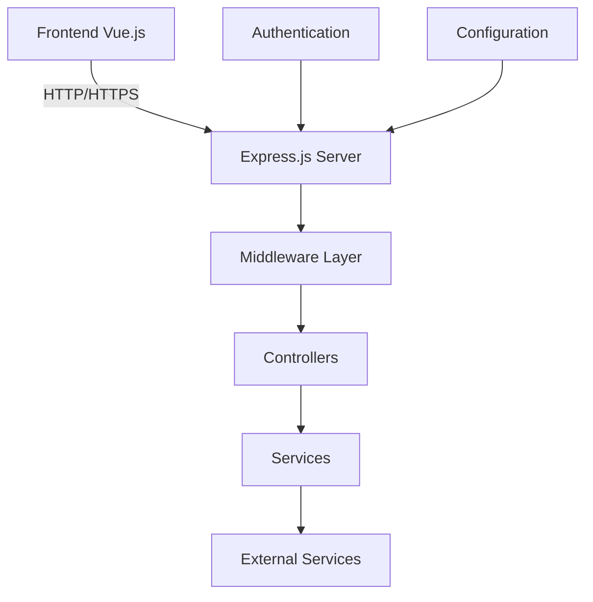

# Documentación Técnica: Integración de Directorio Telefónico - Fase 1

## Resumen Ejecutivo
Este documento detalla la primera fase de la implementación del sistema de directorio telefónico, centrada en la configuración inicial, estructura del proyecto y establecimiento de la base arquitectónica.

## Índice
1. [Arquitectura Base](#arquitectura-base)
2. [Tecnologías y Dependencias](#tecnologías-y-dependencias)
3. [Estructura del Proyecto](#estructura-del-proyecto)
4. [Configuración Inicial](#configuración-inicial)
5. [Implementación Base](#implementación-base)
6. [Seguridad Base](#seguridad-base)
7. [Documentación de Desarrollo](#documentación-de-desarrollo)

## Arquitectura Base

### Diagrama de Arquitectura Inicial


### Principios de Diseño
1. **Separación de Responsabilidades**
   - Frontend independiente
   - Backend modular
   - Servicios desacoplados

2. **Escalabilidad**
   - Arquitectura por capas
   - Modularización
   - Configuración externalizada

3. **Mantenibilidad**
   - Estructura clara de directorios
   - Convenciones de nombrado
   - Documentación inline

## Tecnologías y Dependencias

### Core Dependencies
```json
{
  "dependencies": {
    "express": "4.18.2",
    "cors": "2.8.5",
    "dotenv": "16.3.1",
    "mongoose": "7.6.3",
    "jsonwebtoken": "9.0.0",
    "bcrypt": "5.1.1",
    "helmet": "7.1.0",
    "morgan": "1.10.0",
    "winston": "3.11.0"
  }
}
```

### Development Dependencies
```json
{
  "devDependencies": {
    "nodemon": "3.0.1",
    "jest": "29.7.0",
    "eslint": "8.56.0",
    "prettier": "3.1.0"
  }
}
```

## Estructura del Proyecto

### Árbol de Directorios
```
app_chat_corp/
├── backend/
│   ├── config/
│   │   ├── database.js
│   │   └── logger.js
│   ├── controllers/
│   │   └── userController.js
│   ├── middleware/
│   │   ├── auth.js
│   │   └── errorHandler.js
│   ├── models/
│   │   └── User.js
│   ├── routes/
│   │   └── userRoutes.js
│   ├── services/
│   │   └── userService.js
│   ├── utils/
│   │   └── helpers.js
│   ├── app.js
│   └── server.js
├── frontend/
│   └── vue-app/
└── docs/
```

## Configuración Inicial

### Variables de Entorno
```javascript
// .env
NODE_ENV=development
PORT=3000
MONGODB_URI=mongodb://localhost:27017/chat_bbdd
JWT_SECRET=your-secret-key
JWT_EXPIRES_IN=1h
```

### Configuración de Base de Datos
```javascript
// config/database.js
const mongoose = require('mongoose');

const connectDB = async () => {
    try {
        await mongoose.connect(process.env.MONGODB_URI, {
            useNewUrlParser: true,
            useUnifiedTopology: true,
            autoIndex: false
        });
        console.log('✅ Conexión a la base de datos exitosa');
    } catch (error) {
        console.error('❌ Error al conectar a la base de datos:', error);
        process.exit(1);
    }
};

module.exports = connectDB;
```

## Implementación Base

### Modelo Base de Usuario
```javascript
// models/User.js
const mongoose = require('mongoose');
const bcrypt = require('bcrypt');

const userSchema = new mongoose.Schema({
    username: {
        type: String,
        required: true,
        unique: true
    },
    password: {
        type: String,
        required: true
    },
    role: {
        type: String,
        enum: ['user', 'admin'],
        default: 'user'
    }
}, {
    timestamps: true
});

userSchema.pre('save', async function(next) {
    if (this.isModified('password')) {
        this.password = await bcrypt.hash(this.password, 10);
    }
    next();
});

module.exports = mongoose.model('User', userSchema);
```

### Middleware de Autenticación Base
```javascript
// middleware/auth.js
const jwt = require('jsonwebtoken');

module.exports = (req, res, next) => {
    const authHeader = req.headers.authorization;

    if (!authHeader?.startsWith('Bearer ')) {
        return res.status(401).json({ error: 'Token no proporcionado' });
    }

    const token = authHeader.split(' ')[1];

    try {
        const decoded = jwt.verify(token, process.env.JWT_SECRET);
        req.user = decoded;
        next();
    } catch (err) {
        return res.status(401).json({ error: 'Token inválido' });
    }
};
```

## Seguridad Base

### Configuración de Seguridad
```javascript
// app.js
const express = require('express');
const helmet = require('helmet');
const cors = require('cors');
const morgan = require('morgan');

const app = express();

// Middleware de seguridad
app.use(helmet());
app.use(cors());
app.use(morgan('combined'));
app.use(express.json({ limit: '10kb' }));
```

### Manejo de Errores
```javascript
// middleware/errorHandler.js
const errorHandler = (err, req, res, next) => {
    console.error(err.stack);

    const statusCode = err.statusCode || 500;
    const message = err.message || 'Error interno del servidor';

    res.status(statusCode).json({
        status: 'error',
        statusCode,
        message
    });
};

module.exports = errorHandler;
```

## Documentación de Desarrollo

### Scripts de NPM
```json
{
  "scripts": {
    "start": "node server.js",
    "dev": "nodemon server.js",
    "test": "jest",
    "lint": "eslint .",
    "format": "prettier --write ."
  }
}
```

### Configuración de ESLint
```javascript
// .eslintrc.js
module.exports = {
    env: {
        node: true,
        es2021: true,
        jest: true
    },
    extends: ['eslint:recommended'],
    parserOptions: {
        ecmaVersion: 12
    },
    rules: {
        'no-console': 'warn',
        'no-unused-vars': ['error', { argsIgnorePattern: '^_' }]
    }
};
```

## Archivos Modificados y Creados

### Nuevos Archivos
1. `backend/config/database.js`
   - Configuración de MongoDB
   - Manejo de conexión
   - Opciones de conexión

2. `backend/middleware/auth.js`
   - Middleware de autenticación
   - Validación de tokens
   - Manejo de errores

3. `backend/models/User.js`
   - Esquema de usuario
   - Métodos de modelo
   - Hooks pre/post

4. `backend/app.js`
   - Configuración de Express
   - Middleware global
   - Rutas base

### Archivos Modificados
1. `package.json`
   - Nuevas dependencias
   - Scripts de desarrollo
   - Configuración de proyecto

2. `.env`
   - Variables de entorno
   - Configuración de servicios
   - Secretos

## Referencias Técnicas

### Estándares Seguidos
1. **Estructura de Proyecto**
   - [Express Application Generator](https://expressjs.com/en/starter/generator.html)
   - [Node.js Best Practices](https://github.com/goldbergyoni/nodebestpractices)

2. **Convenciones de Código**
   - [Airbnb JavaScript Style Guide](https://github.com/airbnb/javascript)
   - [Google JavaScript Style Guide](https://google.github.io/styleguide/jsguide.html)

3. **Seguridad**
   - [Express Security Best Practices](https://expressjs.com/en/advanced/best-practice-security.html)
   - [OWASP Node.js Security Cheat Sheet](https://cheatsheetseries.owasp.org/cheatsheets/Nodejs_Security_Cheat_Sheet.html)

### Herramientas de Desarrollo
| Herramienta | Versión | Propósito |
|-------------|---------|-----------|
| VS Code | 1.84.0 | IDE principal |
| Postman | 10.20 | Pruebas de API |
| Git | 2.42.0 | Control de versiones |
| MongoDB Compass | 1.40.4 | GUI de base de datos |

## Próximos Pasos

### Fase 2
1. Implementación del servicio de directorio telefónico
2. Integración con la central telefónica XML
3. Sistema de caché
4. Endpoints de la API
5. Pruebas automatizadas

### Mejoras Planificadas
1. Implementación de logs estructurados
2. Monitoreo de aplicación
3. Documentación de API con Swagger
4. Pruebas de integración
5. Pipeline de CI/CD 