# Diagramas de Actividad - Chat Corporativo

## 1. Proceso de Autenticación

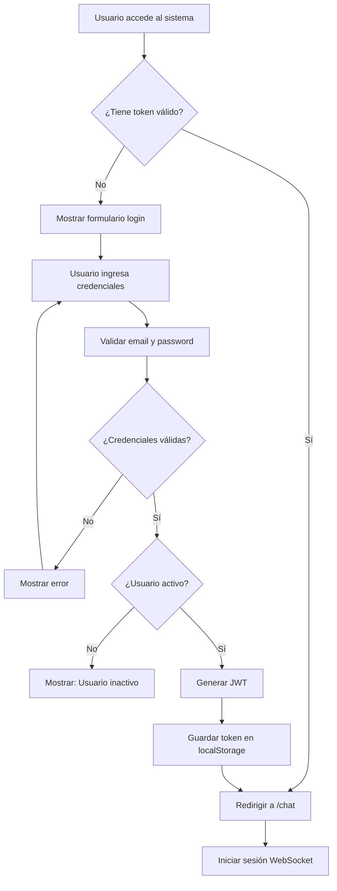

## 2. Envío de Mensaje

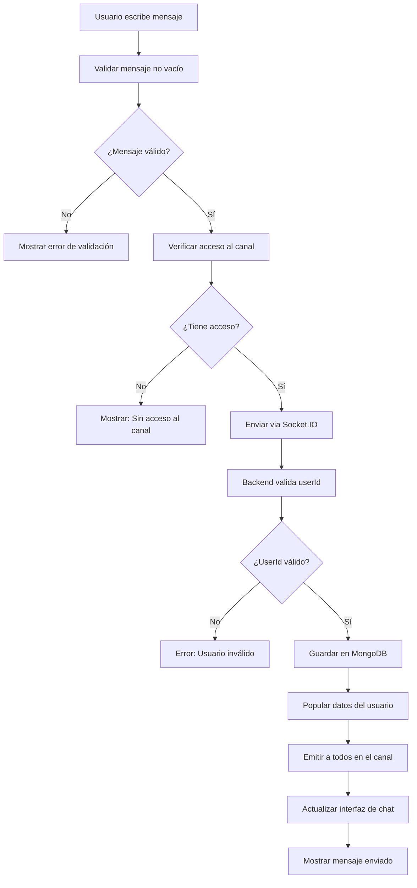

## 3. Unirse a Canal

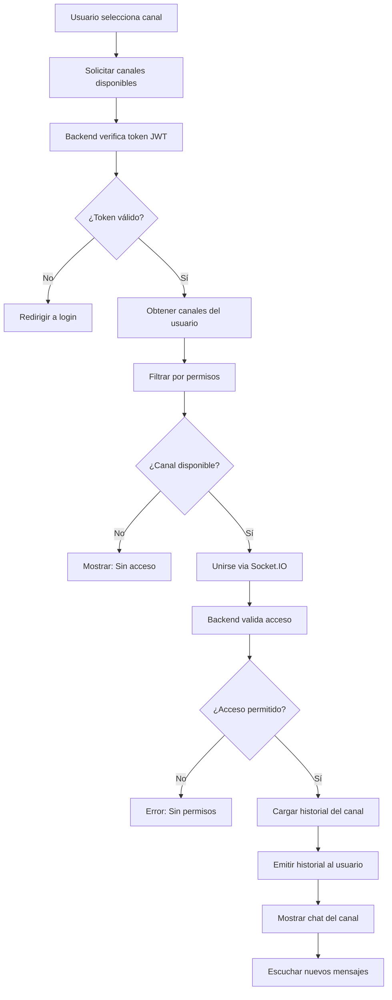

## 4. Crear Canal (Admin)

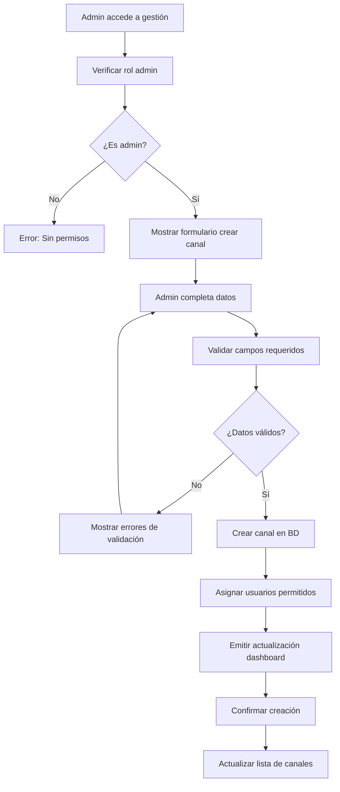

## 5. Enviar Sugerencia

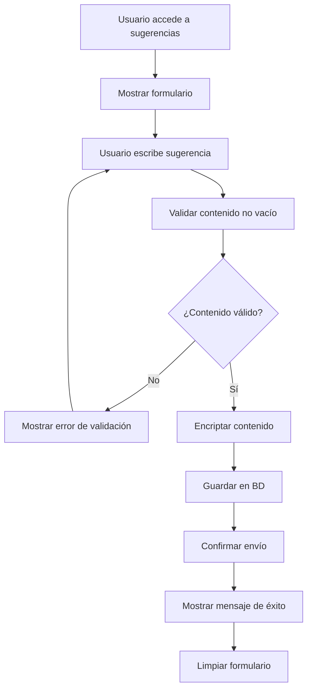

## 6. Revisar Sugerencias (Admin)

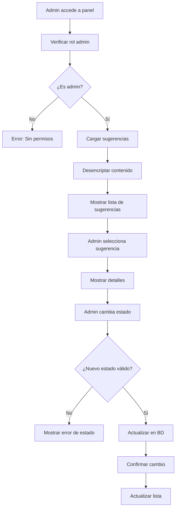

## 7. Crear Anuncio (Admin)

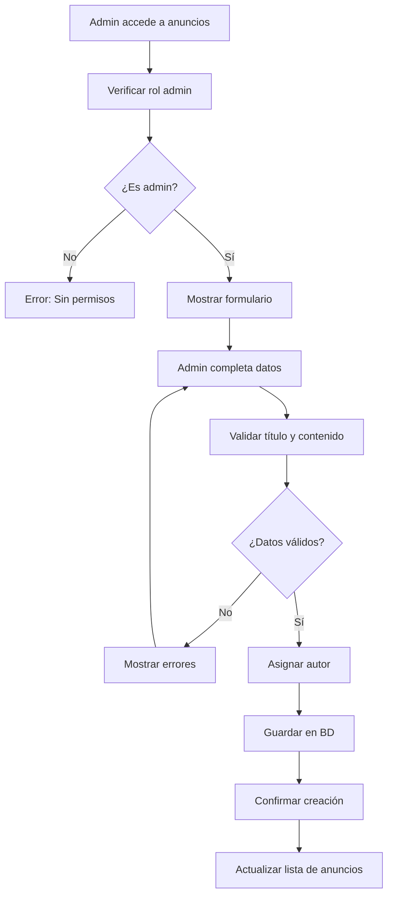

## 8. Ver Dashboard (Admin)

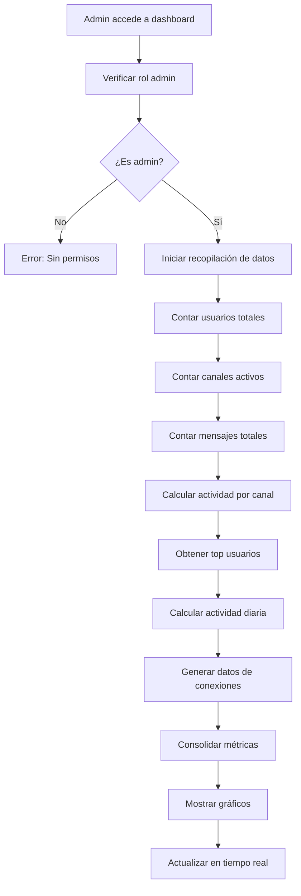

## 9. Gestión de Usuarios (Admin)

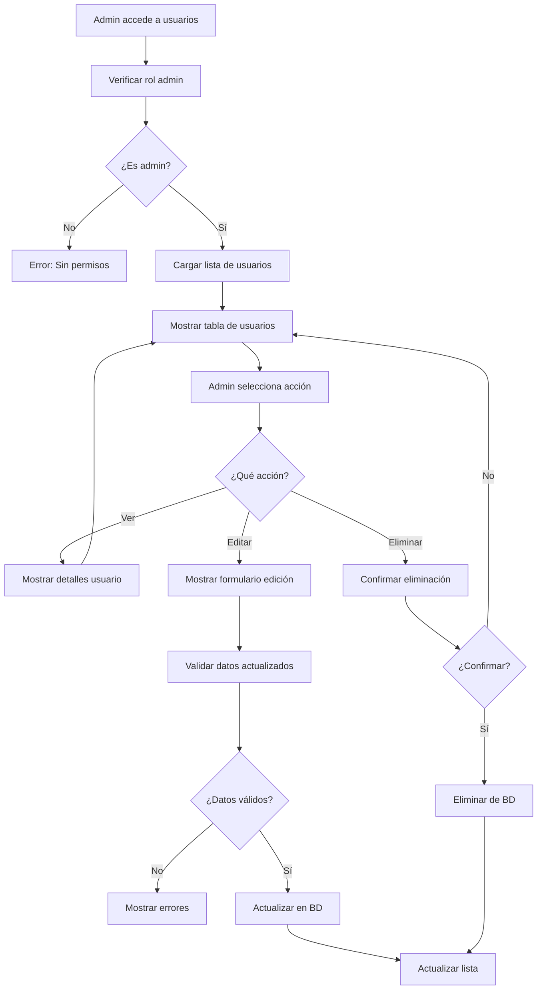

## 10. Búsqueda en Phonebook

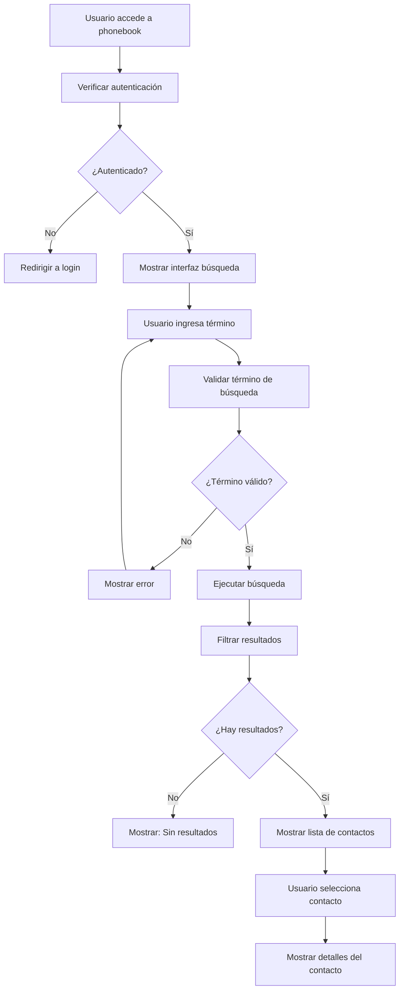

## 11. Flujo de Reconexión WebSocket

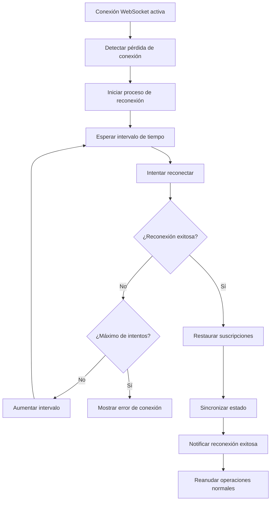

## 12. Flujo de Validación de Permisos

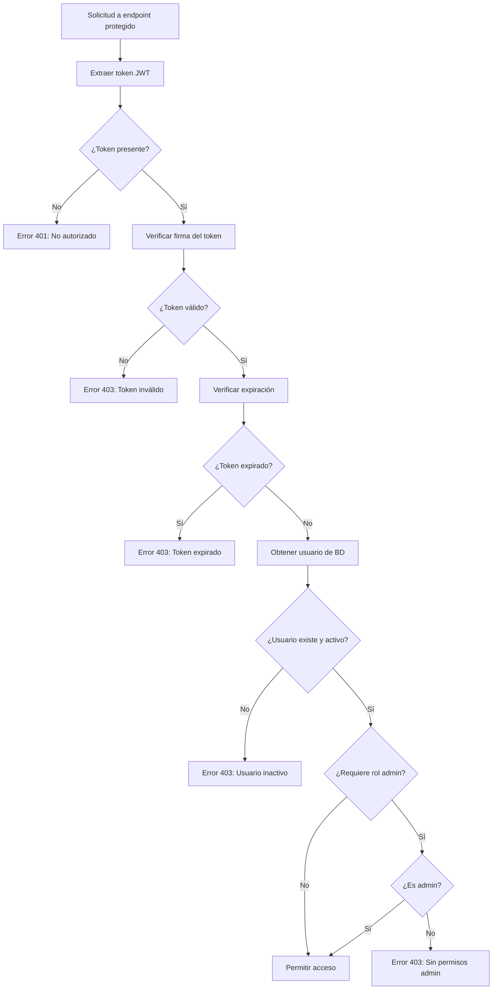

## Notas sobre los Flujos

### Puntos de Decisión Clave
- **Autenticación**: Token JWT válido y no expirado
- **Autorización**: Verificación de roles (admin/usuario)
- **Validación**: Campos requeridos y formatos correctos
- **Permisos**: Acceso a canales según configuración

### Manejo de Errores
- **401**: No autenticado
- **403**: Sin permisos o token inválido
- **400**: Datos de entrada inválidos
- **404**: Recurso no encontrado
- **500**: Error interno del servidor

### Flujos Asíncronos
- **WebSocket**: Comunicación en tiempo real
- **Reconexión**: Manejo automático de desconexiones
- **Validación**: Verificaciones en múltiples capas