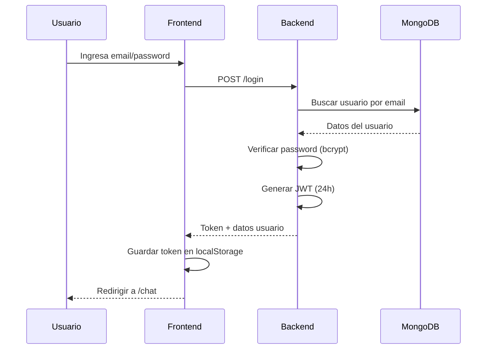
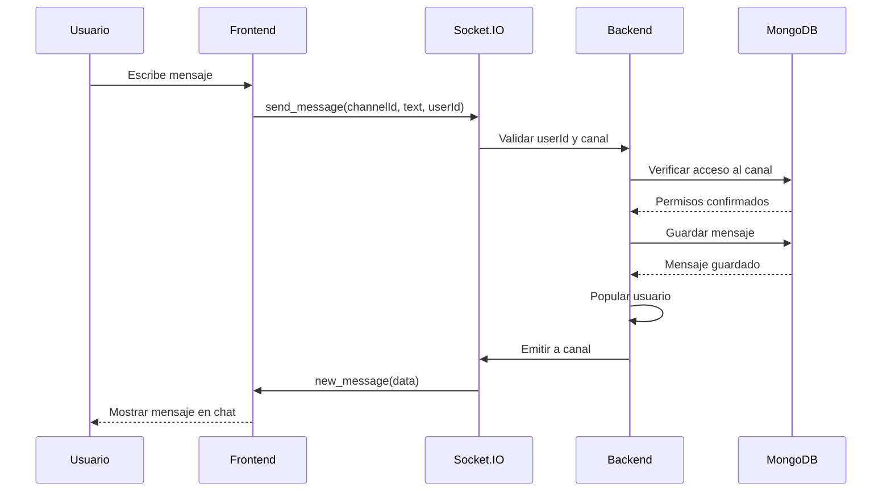
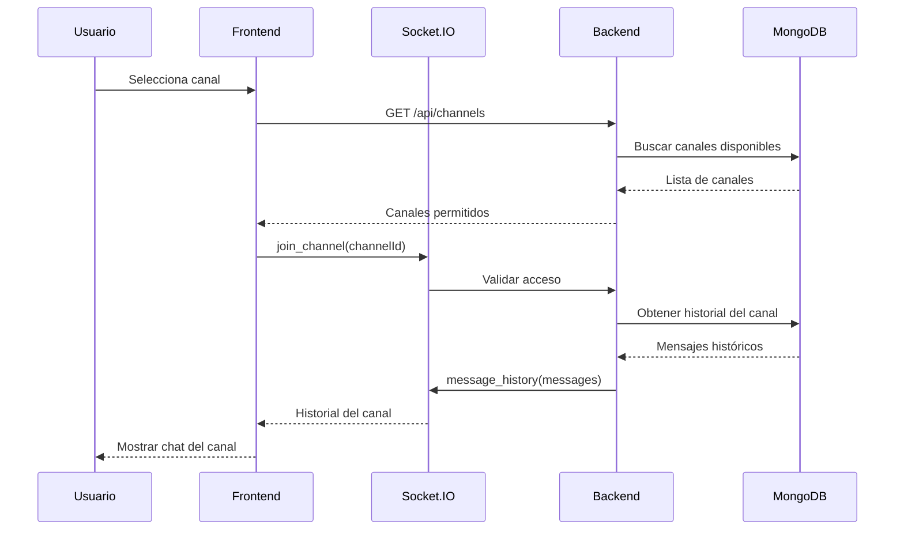
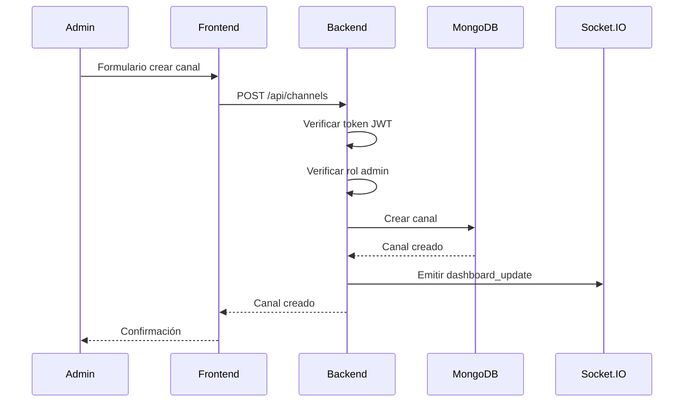
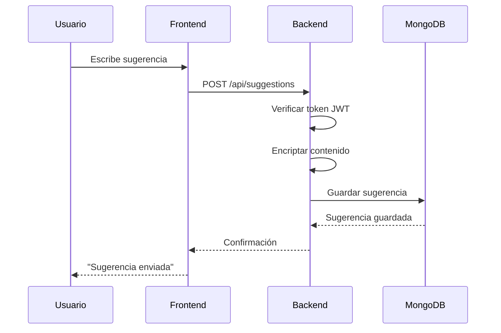
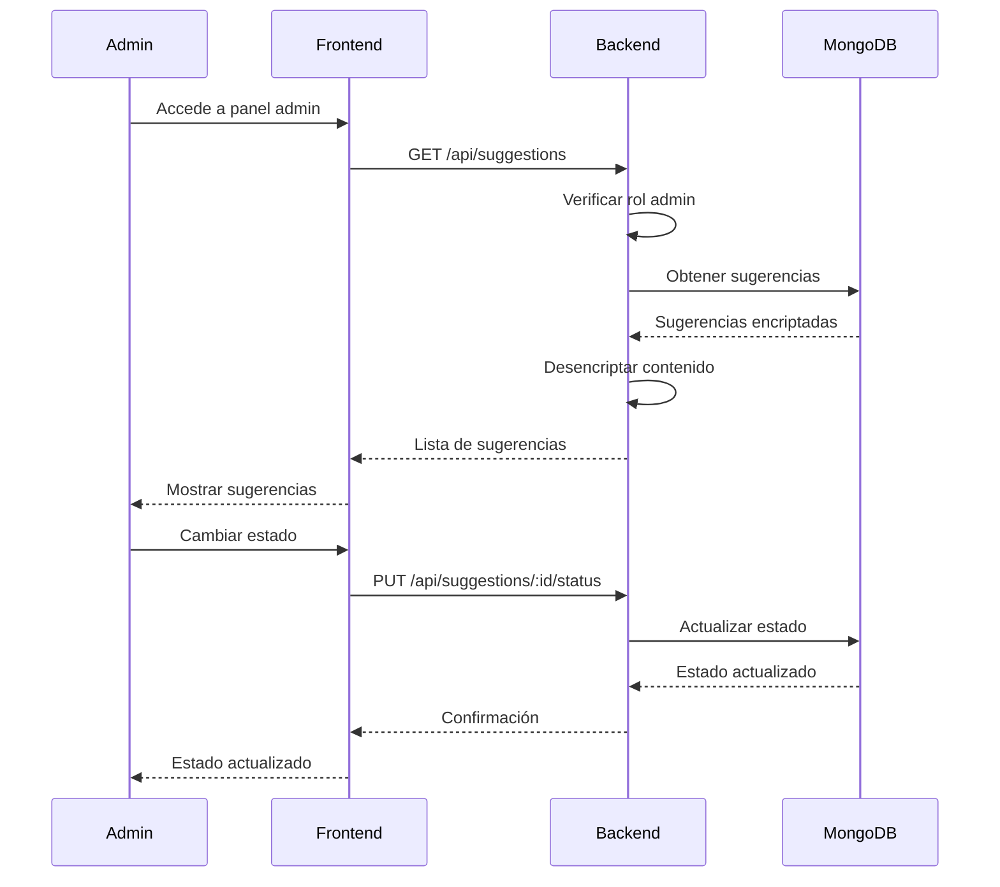
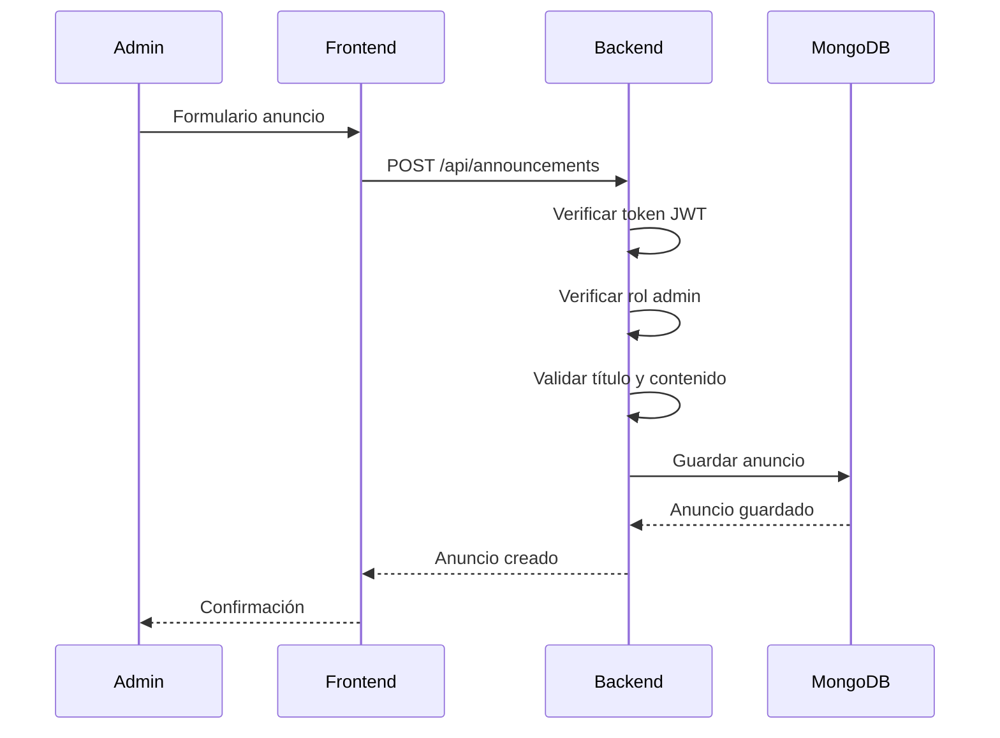
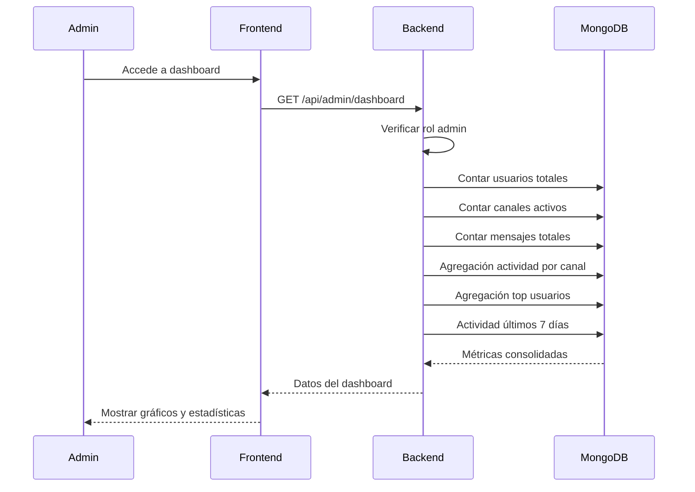
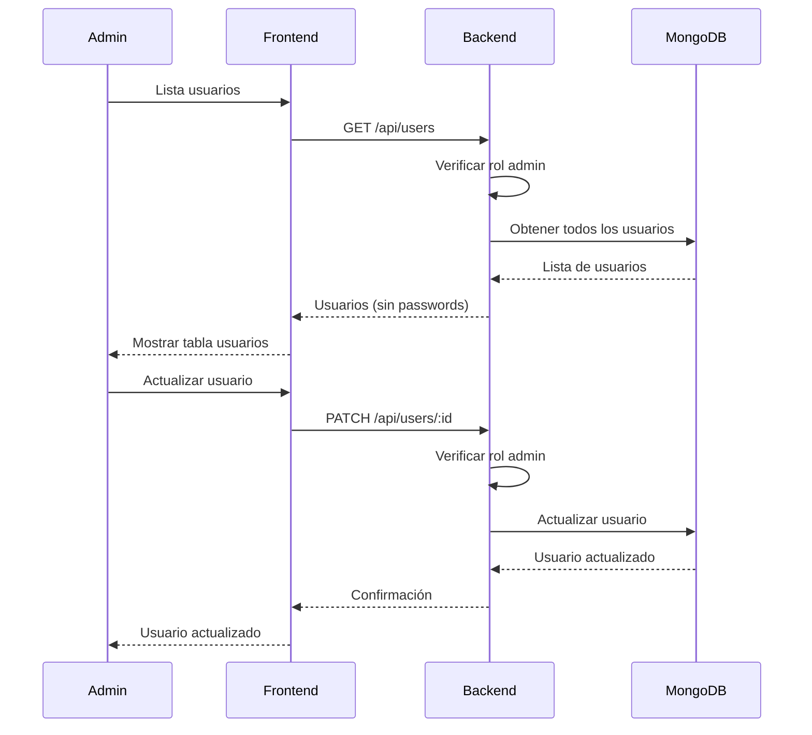
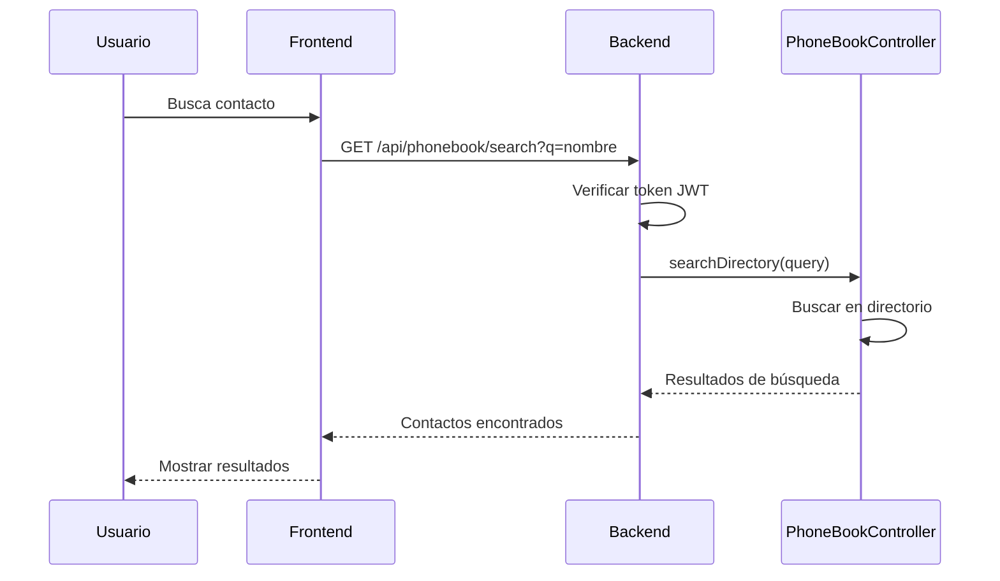

# Diagramas de Secuencia - Chat Corporativo

## 1. Autenticación de Usuario

## 2. Envío de Mensaje en Tiempo Real

## 3. Unirse a Canal

## 4. Crear Canal (Admin)

## 5. Enviar Sugerencia

## 6. Revisar Sugerencias (Admin)

## 7. Crear Anuncio (Admin)

## 8. Ver Dashboard (Admin)

## 9. Gestión de Usuarios (Admin)

## 10. Phonebook - Buscar Contacto

## Notas sobre los Flujos

### Autenticación
- JWT con expiración de 24 horas
- Verificación de usuario activo
- Almacenamiento seguro del token

### Tiempo Real
- Socket.IO para comunicación bidireccional
- Validación de permisos por canal
- Persistencia en MongoDB

### Seguridad
- Verificación de roles en cada endpoint
- Encriptación de sugerencias
- Validación de acceso a canales

### Administración
- Dashboard con métricas en tiempo real
- Gestión completa de usuarios y canales
- Control de estados de sugerencias