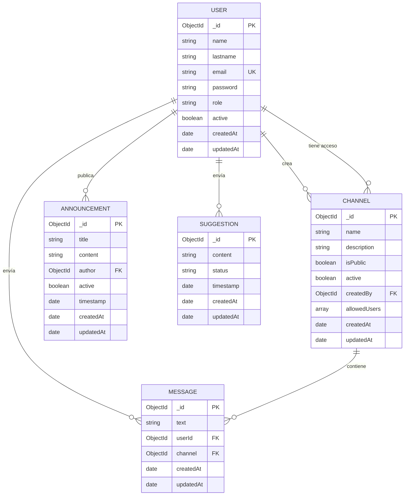
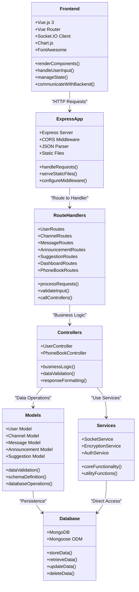
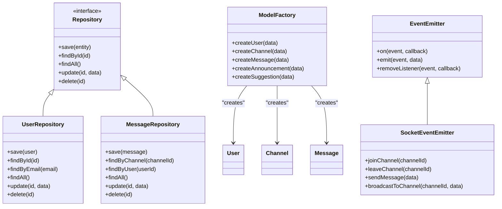

# Diagrama de Clases - Chat Corporativo

## Diagrama Principal del Sistema

```mermaid
classDiagram
    %% Entidades principales
    class User {
        +ObjectId _id
        +String name
        +String lastname
        +String email
        +String password
        +String role
        +Boolean active
        +Date createdAt
        +Date updatedAt
        
        +save()
        +findById(id)
        +findByEmail(email)
        +updateUser(data)
        +deleteUser()
        +validatePassword(password)
        +hashPassword()
    }

    class Channel {
        +ObjectId _id
        +String name
        +String description
        +Boolean isPublic
        +Boolean active
        +ObjectId createdBy
        +Array~ObjectId~ allowedUsers
        +Date createdAt
        +Date updatedAt
        
        +save()
        +findById(id)
        +findPublicChannels()
        +findUserChannels(userId)
        +addAllowedUser(userId)
        +removeAllowedUser(userId)
        +updateChannel(data)
        +deleteChannel()
    }

    class Message {
        +ObjectId _id
        +String text
        +ObjectId userId
        +ObjectId channel
        +Date createdAt
        +Date updatedAt
        
        +save()
        +findByChannel(channelId)
        +findByUser(userId)
        +createMessage(data)
        +deleteMessage()
        +getMessageHistory(channelId)
    }

    class Announcement {
        +ObjectId _id
        +String title
        +String content
        +ObjectId author
        +Boolean active
        +Date timestamp
        +Date createdAt
        +Date updatedAt
        
        +save()
        +findById(id)
        +findActiveAnnouncements()
        +createAnnouncement(data)
        +updateAnnouncement(data)
        +deleteAnnouncement()
    }

    class Suggestion {
        +ObjectId _id
        +String content
        +String status
        +Date timestamp
        +Date createdAt
        +Date updatedAt
        
        +save()
        +findById(id)
        +findByStatus(status)
        +createSuggestion(data)
        +updateStatus(status)
        +deleteSuggestion()
    }

    %% Controladores
    class UserController {
        +validateToken(req, res, next)
        +registerUser(req, res)
        +loginUser(req, res)
        +getAllUsers(req, res)
        +getUserById(req, res)
        +updateUser(req, res)
        +deleteUser(req, res)
    }

    class PhoneBookController {
        +getDirectory(req, res)
        +searchDirectory(req, res)
    }

    %% Middleware
    class AuthMiddleware {
        +authenticateToken(req, res, next)
        +isAdmin(req, res, next)
        +checkChannelAccess(req, res, next)
    }

    %% Servicios
    class SocketService {
        +init(server)
        +getIO()
        +handleConnection(socket)
        +joinChannel(socket, channelId)
        +sendMessage(socket, data)
        +emitToChannel(channelId, event, data)
    }

    class EncryptionService {
        +encrypt(text)
        +decrypt(encryptedText)
        +generateKey()
    }

    %% Relaciones principales
    User ||--o{ Message : "envía"
    Channel ||--o{ Message : "contiene"
    User ||--o{ Channel : "crea"
    User ||--o{ Channel : "tiene acceso"
    User ||--o{ Announcement : "publica"
    User ||--o{ Suggestion : "envía"
    
    %% Relaciones de control
    UserController --> User : "maneja"
    PhoneBookController --> User : "consulta"
    AuthMiddleware --> User : "valida"
    SocketService --> Message : "transmite"
    SocketService --> Channel : "gestiona"
    EncryptionService --> Suggestion : "protege"
```

## Diagrama de Relaciones de Base de Datos



## Diagrama de Arquitectura de Capas



## Diagrama de Patrones de Diseño



## Notas sobre las Clases

### Entidades Principales
- **User**: Gestión de usuarios con roles y autenticación
- **Channel**: Canales de chat con permisos públicos/privados
- **Message**: Mensajes con relación a usuario y canal
- **Announcement**: Anuncios del sistema
- **Suggestion**: Sugerencias con encriptación

### Controladores
- **UserController**: Lógica de negocio para usuarios
- **PhoneBookController**: Gestión del directorio telefónico

### Servicios
- **SocketService**: Comunicación en tiempo real
- **EncryptionService**: Cifrado de datos sensibles
- **AuthService**: Autenticación y autorización

### Relaciones Clave
- **1:N** Usuario → Mensajes
- **1:N** Canal → Mensajes
- **N:M** Usuario ↔ Canal (acceso)
- **1:N** Usuario → Anuncios
- **1:N** Usuario → Sugerencias

### Patrones Implementados
- **Repository**: Abstracción de acceso a datos
- **Factory**: Creación de entidades
- **Observer**: Eventos en tiempo real
- **Middleware**: Autenticación y autorización