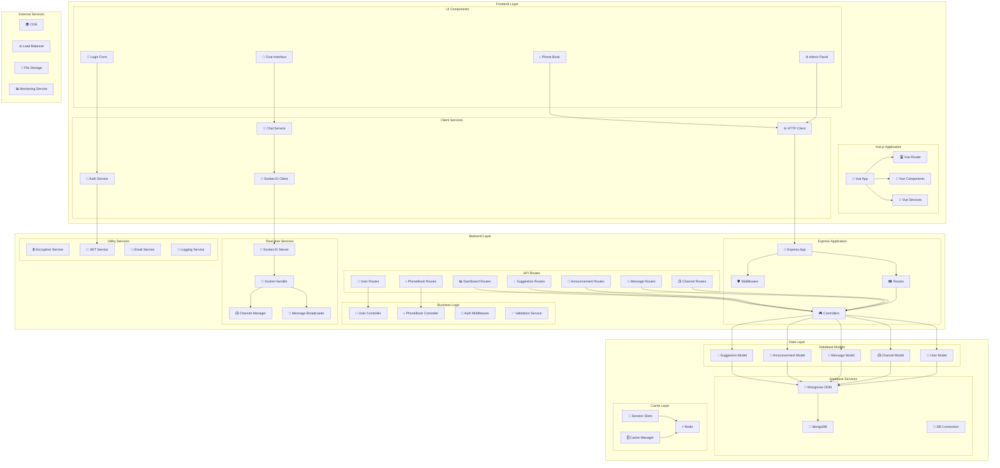
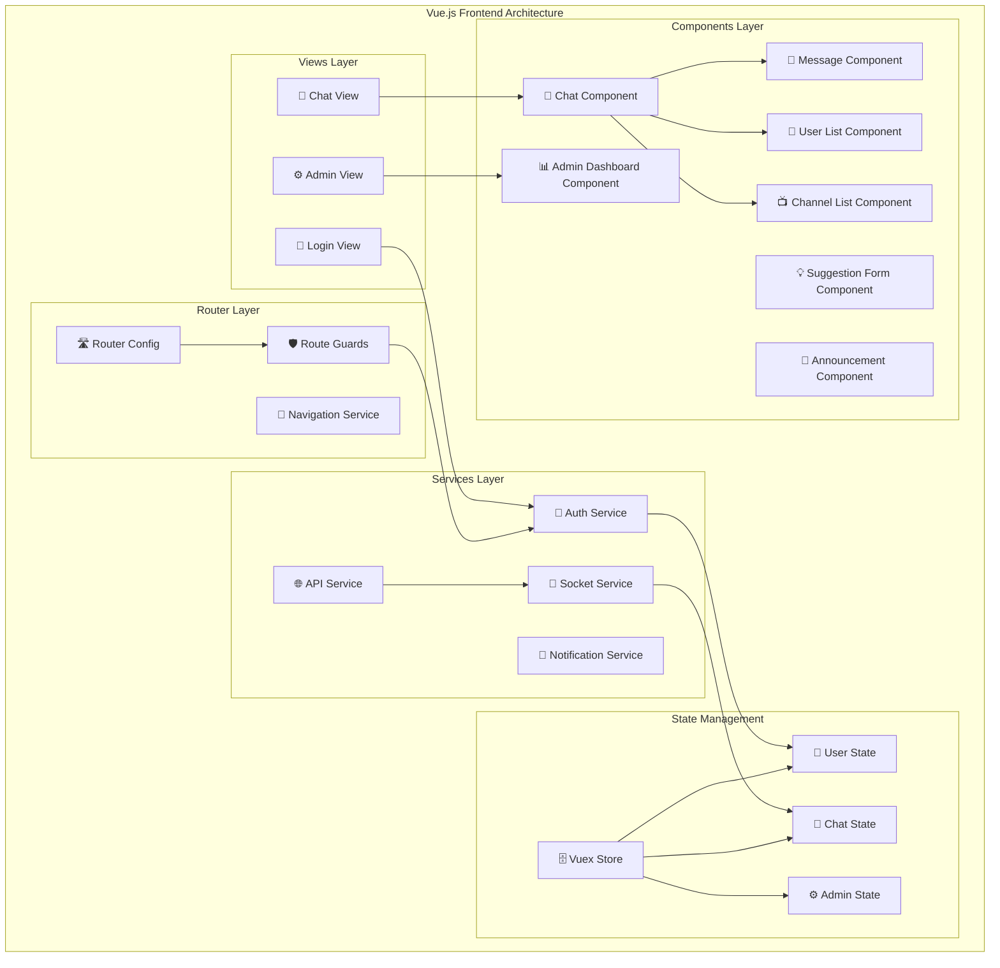
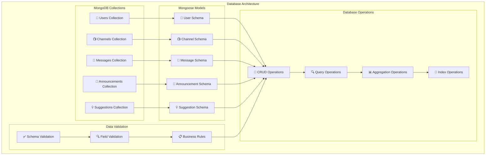
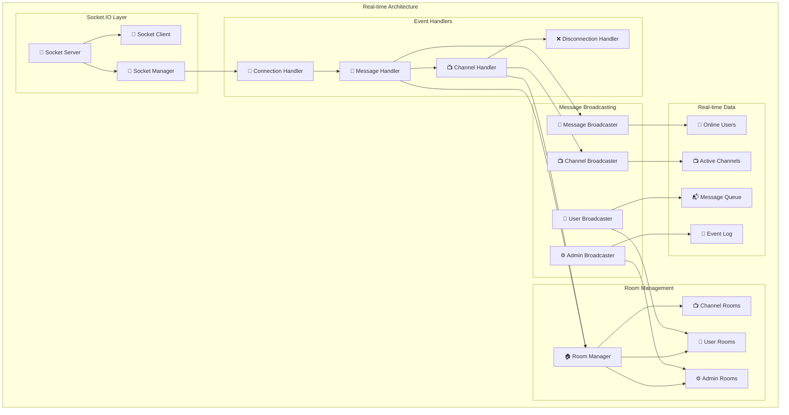
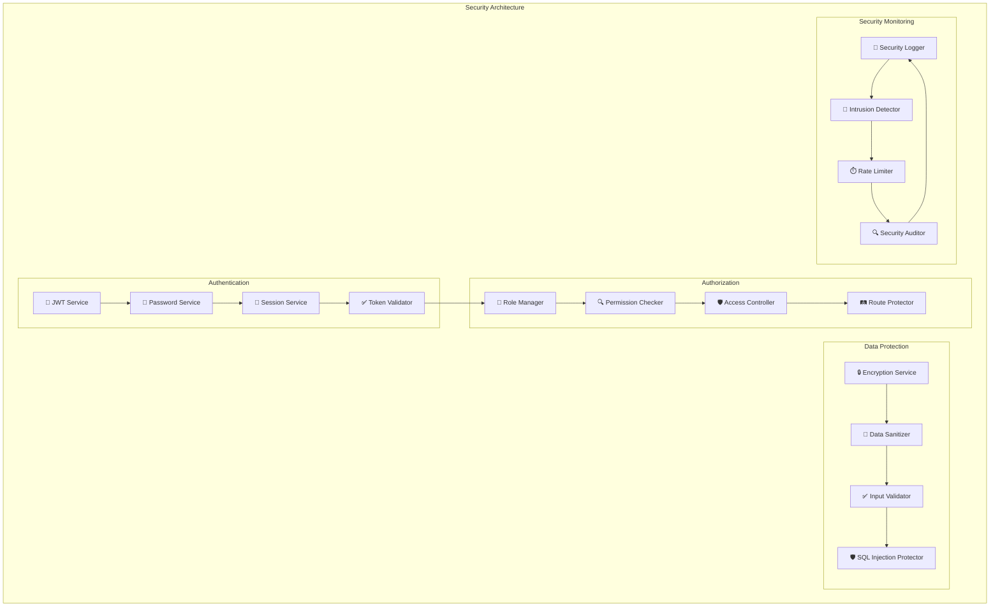

# Diagrama de Componentes - Chat Corporativo

## Arquitectura de Componentes Principal

## Componentes del Frontend

## Componentes del Backend

```mermaid
graph TB
    subgraph "Node.js Backend Architecture"
        subgraph "Application Layer"
            AppEntry[🚀 App Entry Point]
            ServerConfig[⚙️ Server Configuration]
            MiddlewareStack[🛡️ Middleware Stack]
        end
        
        subgraph "Route Layer"
            RouteManager[🛤️ Route Manager]
            RouteHandlers[📋 Route Handlers]
            RouteMiddleware[🔒 Route Middleware]
        end
        
        subgraph "Controller Layer"
            BaseController[🎮 Base Controller]
            UserController[👤 User Controller]
            ChannelController[📺 Channel Controller]
            MessageController[💬 Message Controller]
            AdminController[⚙️ Admin Controller]
        end
        
        subgraph "Service Layer"
            BusinessLogic[🧠 Business Logic]
            ValidationService[✅ Validation Service]
            EncryptionService[🔒 Encryption Service]
            NotificationService[📢 Notification Service]
        end
        
        subgraph "Data Access Layer"
            Repository[🗄️ Repository]
            ModelFactory[🏭 Model Factory]
            QueryBuilder[🔍 Query Builder]
        end
        
        subgraph "Infrastructure Layer"
            DatabaseConnection[🔌 Database Connection]
            CacheConnection[⚡ Cache Connection]
            SocketConnection[🔌 Socket Connection]
            LoggingSystem[📝 Logging System]
        end
    end

    AppEntry --> ServerConfig
    ServerConfig --> MiddlewareStack
    MiddlewareStack --> RouteManager
    
    RouteManager --> RouteHandlers
    RouteHandlers --> RouteMiddleware
    RouteMiddleware --> BaseController
    
    BaseController --> UserController
    BaseController --> ChannelController
    BaseController --> MessageController
    BaseController --> AdminController
    
    UserController --> BusinessLogic
    ChannelController --> BusinessLogic
    MessageController --> BusinessLogic
    AdminController --> BusinessLogic
    
    BusinessLogic --> ValidationService
    BusinessLogic --> EncryptionService
    BusinessLogic --> NotificationService
    
    ValidationService --> Repository
    EncryptionService --> Repository
    NotificationService --> Repository
    
    Repository --> ModelFactory
    ModelFactory --> QueryBuilder
    QueryBuilder --> DatabaseConnection
    
    DatabaseConnection --> CacheConnection
    CacheConnection --> SocketConnection
    SocketConnection --> LoggingSystem
```

## Componentes de Base de Datos

## Componentes de Tiempo Real

## Componentes de Seguridad

## Notas sobre los Componentes

### **Frontend (Vue.js)**
- **Views**: Páginas principales (Login, Chat, Admin)
- **Components**: Elementos reutilizables
- **Services**: Lógica de negocio del cliente
- **State**: Gestión de estado con Vuex

### **Backend (Node.js)**
- **Controllers**: Lógica de negocio
- **Services**: Servicios especializados
- **Models**: Esquemas de base de datos
- **Middleware**: Funciones de procesamiento

### **Base de Datos**
- **MongoDB**: Almacenamiento principal
- **Redis**: Cache y sesiones
- **Mongoose**: ODM para MongoDB

### **Tiempo Real**
- **Socket.IO**: Comunicación bidireccional
- **Rooms**: Gestión de salas por canal
- **Events**: Manejo de eventos en tiempo real

### **Seguridad**
- **JWT**: Autenticación stateless
- **Roles**: Control de acceso
- **Encriptación**: Protección de datos sensibles
- **Validación**: Sanitización de entrada