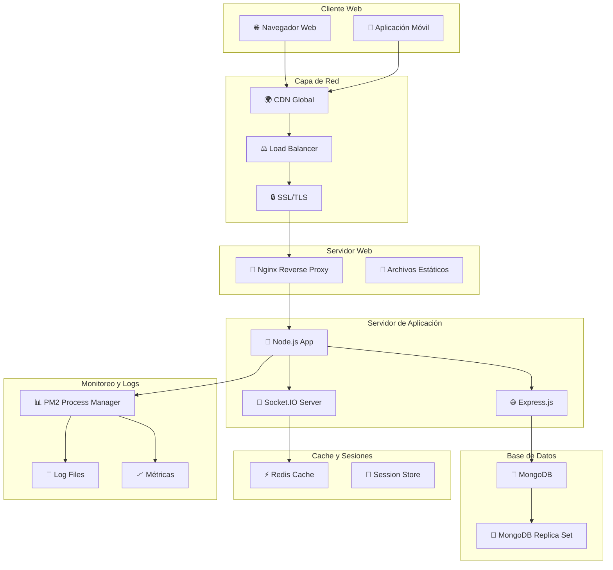
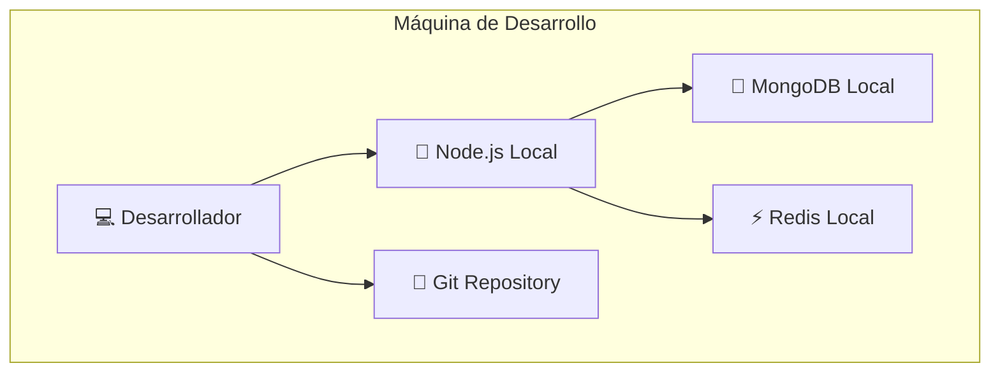
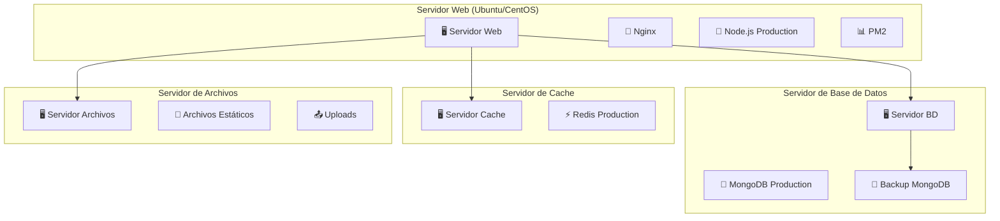
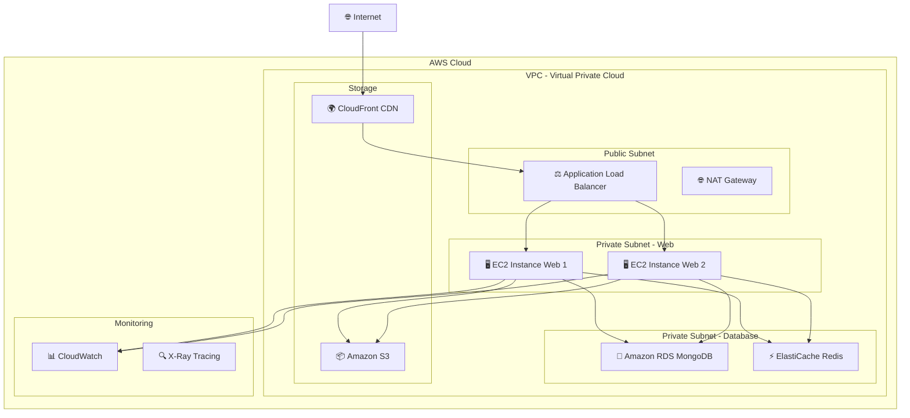
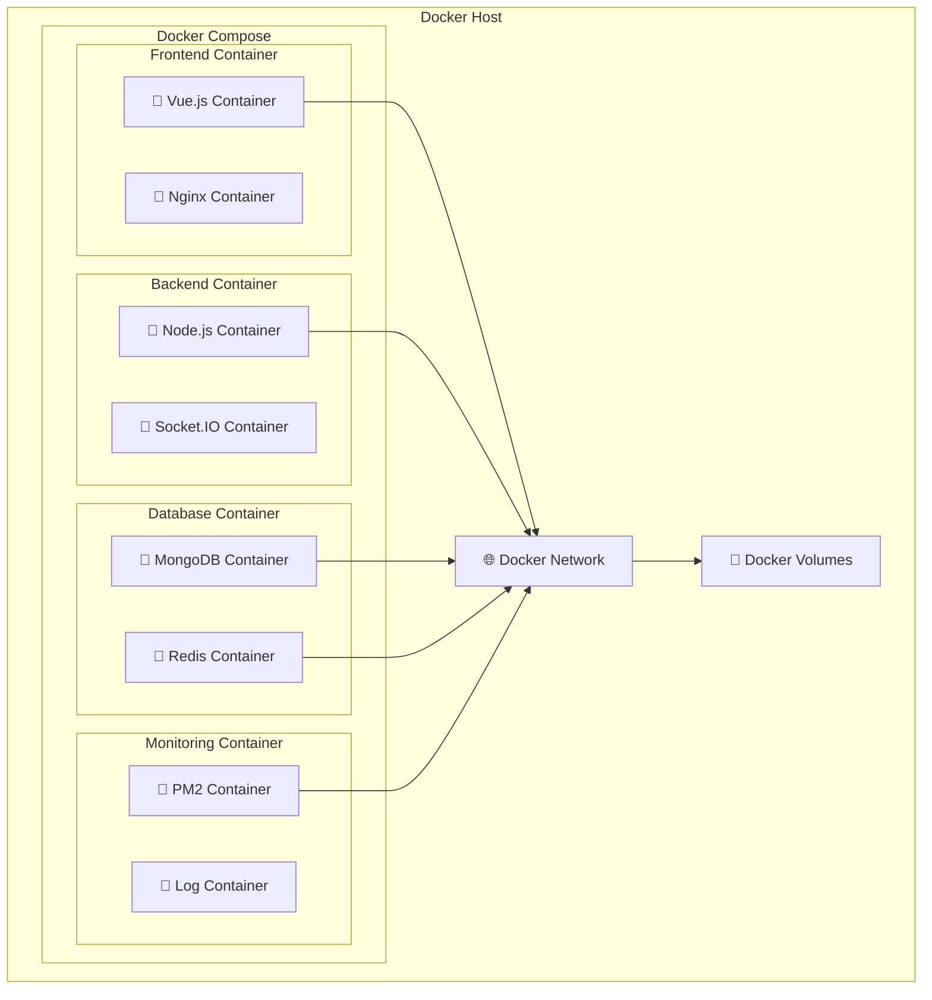
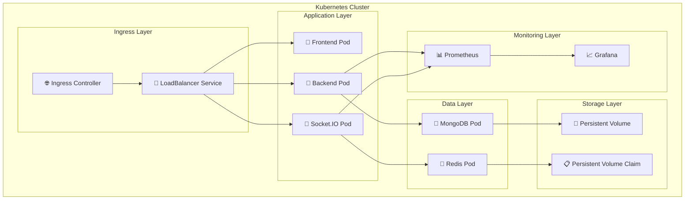

# Diagrama de Despliegue - Chat Corporativo

## Arquitectura de Despliegue Principal



## Despliegue en Desarrollo



## Despliegue en Producción



## Despliegue en la Nube (AWS)



## Despliegue con Docker



## Despliegue con Kubernetes



## Configuración de Servicios

### Nginx Configuration
```nginx
upstream backend {
    server 127.0.0.1:3000;
    server 127.0.0.1:3001;
}

server {
    listen 80;
    server_name chat-corp.com;
    
    location / {
        proxy_pass http://backend;
        proxy_http_version 1.1;
        proxy_set_header Upgrade $http_upgrade;
        proxy_set_header Connection 'upgrade';
        proxy_set_header Host $host;
        proxy_cache_bypass $http_upgrade;
    }
    
    location /socket.io/ {
        proxy_pass http://backend;
        proxy_http_version 1.1;
        proxy_set_header Upgrade $http_upgrade;
        proxy_set_header Connection "upgrade";
    }
}
```

### PM2 Configuration
```json
{
  "apps": [
    {
      "name": "chat-corp-backend",
      "script": "app.js",
      "instances": 2,
      "exec_mode": "cluster",
      "env": {
        "NODE_ENV": "production",
        "PORT": 3000
      }
    }
  ]
}
```

### Docker Compose
```yaml
version: '3.8'
services:
  frontend:
    build: ./frontend/vue-app
    ports:
      - "80:80"
    depends_on:
      - backend

  backend:
    build: ./backend
    ports:
      - "3000:3000"
    environment:
      - NODE_ENV=production
      - DB_URL=mongodb://mongo:27017/chat_bbdd
    depends_on:
      - mongo
      - redis

  mongo:
    image: mongo:latest
    ports:
      - "27017:27017"
    volumes:
      - mongo_data:/data/db

  redis:
    image: redis:latest
    ports:
      - "6379:6379"

volumes:
  mongo_data:
```

## Consideraciones de Despliegue

### Seguridad
- **SSL/TLS**: Certificados para HTTPS
- **Firewall**: Reglas de puertos
- **Autenticación**: JWT con expiración
- **CORS**: Configuración de orígenes

### Escalabilidad
- **Load Balancer**: Distribución de carga
- **Clustering**: Múltiples instancias Node.js
- **Cache**: Redis para sesiones
- **CDN**: Archivos estáticos

### Monitoreo
- **PM2**: Gestión de procesos
- **Logs**: Rotación y almacenamiento
- **Métricas**: CPU, memoria, red
- **Alertas**: Notificaciones automáticas

### Backup
- **Base de Datos**: Backups automáticos
- **Archivos**: Sincronización
- **Configuración**: Versionado
- **Recuperación**: Plan de contingencia