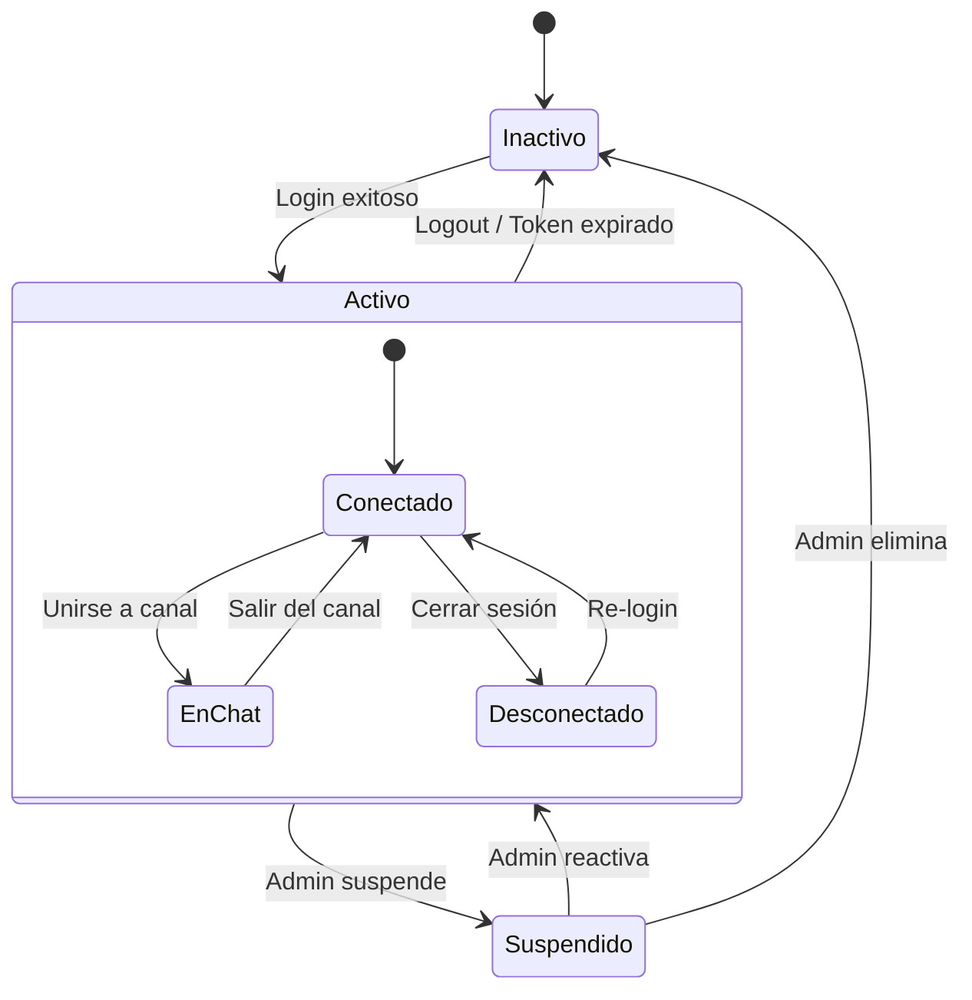
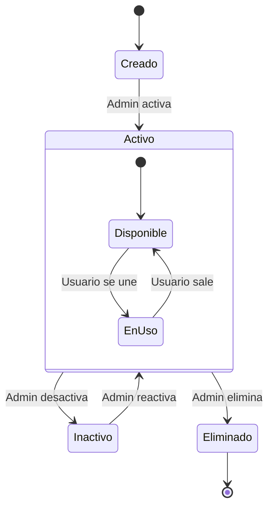
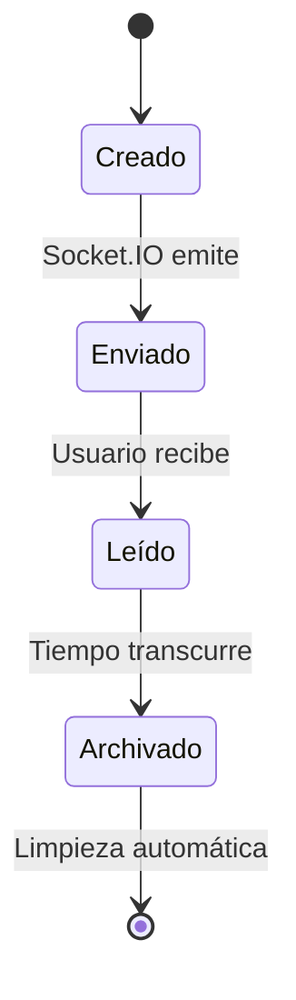
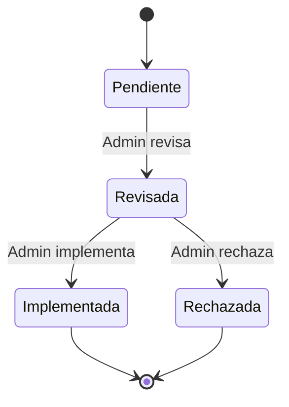
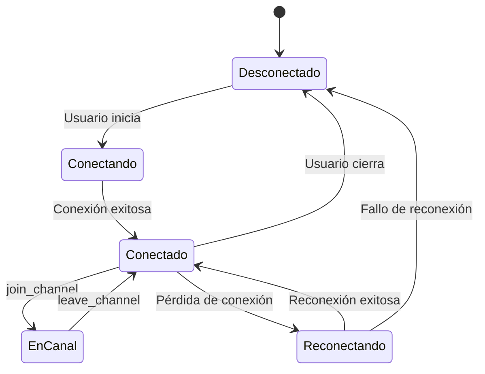
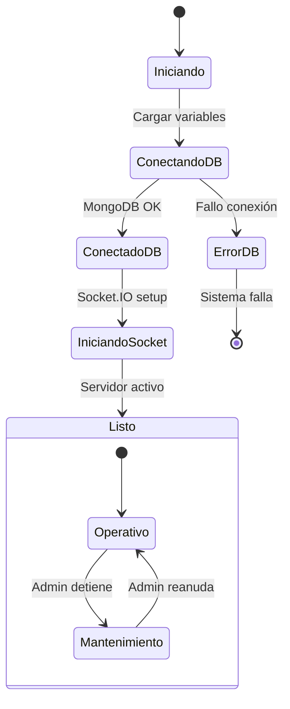
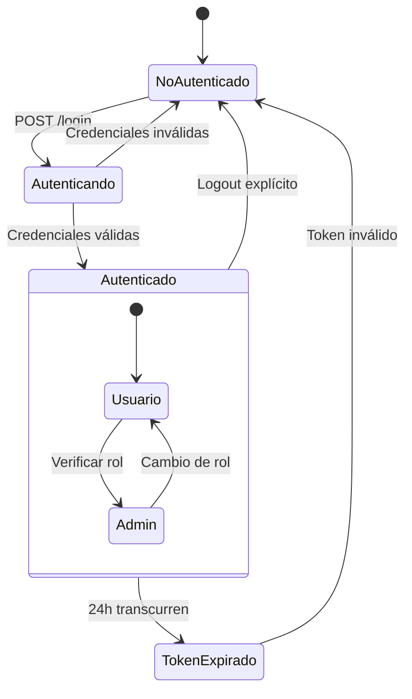

# Diagrama de Estados - Chat Corporativo

## Estados de Usuario

## Estados de Canal

## Estados de Mensaje

## Estados de Sugerencia

## Estados de Sesión WebSocket

## Estados del Sistema (Dashboard)

## Estados de Autenticación

## Notas sobre los Estados

### Usuario
- **Inactivo**: Usuario no autenticado o eliminado
- **Activo**: Usuario autenticado con token válido
- **Suspendido**: Usuario temporalmente deshabilitado por admin

### Canal
- **Creado**: Canal recién creado, no disponible aún
- **Activo**: Canal disponible para uso
- **Inactivo**: Canal deshabilitado temporalmente
- **Eliminado**: Canal eliminado permanentemente

### Mensaje
- **Creado**: Mensaje guardado en BD
- **Enviado**: Mensaje emitido via Socket.IO
- **Leído**: Mensaje recibido por usuarios
- **Archivado**: Mensaje antiguo para limpieza

### Sugerencia
- **Pendiente**: Sugerencia nueva sin revisar
- **Revisada**: Admin ha revisado la sugerencia
- **Implementada**: Sugerencia aplicada
- **Rechazada**: Sugerencia descartada

### WebSocket
- Estados de conexión en tiempo real
- Manejo de reconexión automática
- Gestión de salas por canal

### Sistema
- Estados de inicialización del servidor
- Conexión a base de datos
- Configuración de Socket.IO